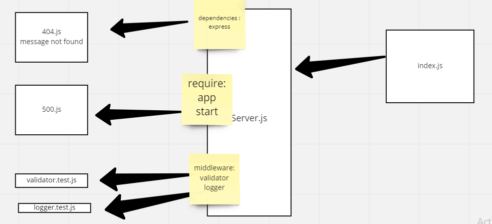

# basic-express-server
## Deployment
> Author: Mohammad Mahmoud Altamimi
 
 

## Heroku Application
[class02-basic-server](https://class02-basic-server.herokuapp.com/person?name=mohammad)
 
 

## GitHub Actions
[GitHub Action](https://github.com/MohammadAltamimi98/basic-express-server/actions)

 
 

## Pull Requests
[GitHub Pull Request](https://github.com/MohammadAltamimi98/basic-express-server/pull/1)

 
 

# Setup

## Installed dependencies
> npm i dotenv
> npm i express
> npm i -D jest supertest
 
 

## .env requirments
> * PORT - port number

 
 

## Running the application
> * npm start
> * Endpoint: **/person?name=name**

 
 

## Tests
> * Unit Tests: npm run test
> * Lint Tests: npm run lint

 
 

UML DRAWING:

